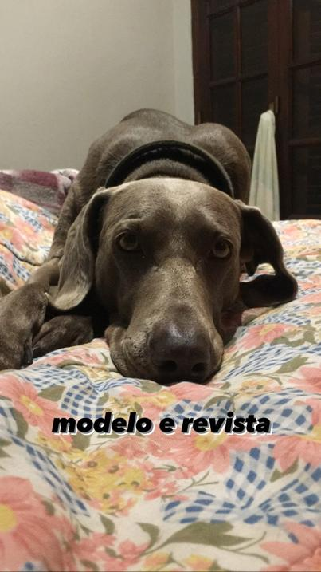
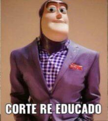

# Iña :)

☆ Soy _Iñaki Aristia_ del curso K2104 de Paradigmas de Programación de la Universidad Tecnológica Nacional (FRBA)


☆ Mi apellido significa  ***bosque de robles*** o.O

☆ Arranqué a cursar el 2020 y aprobé una sola materia (Química), pero ya estoy remontando 👍

☆ Me gusta todo el deporte en general, ver y practicar, especialmente fútbol, natación y básquet

☆ This is Kuma ^-^



☆ Amo descurbir nueva música, últimamente estoy escuchando mucho una banda que se llama ***Pacífica*** (https://www.youtube.com/watch?v=PEfsyxNPH4E)




```
Legajo: 176.382-9
